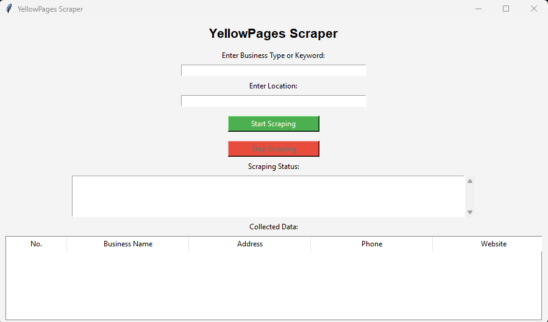
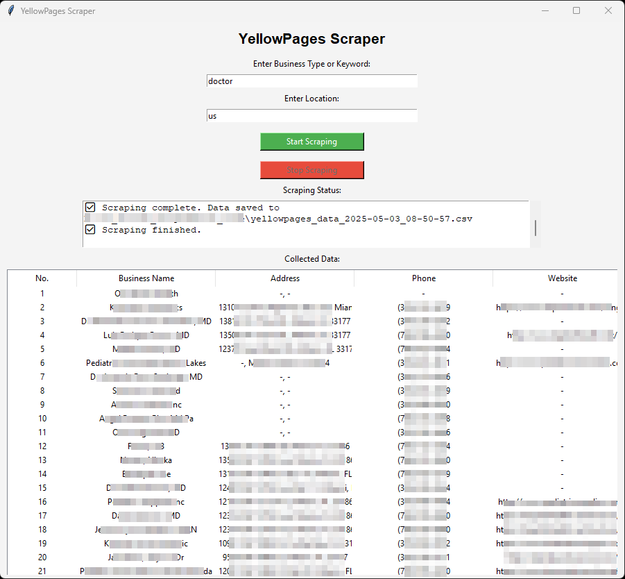

# 🟡 YellowPages Business Scraper

A Python desktop tool that scrapes business data like name, address, phone, and website from [YellowPages.com](https://www.yellowpages.com/) using **Selenium**, **BeautifulSoup**, and a **user-friendly GUI built with Tkinter**.

---

## 📌 Why This Project?

In the digital age, lead generation and data collection are essential for businesses, marketers, and researchers. YellowPages has tons of valuable contact data — but it's not downloadable. This tool **automates** the process of collecting public business listings, saving hours of manual copy-pasting.

---

## 🚀 Features

* ✅ Simple GUI interface — no coding needed!
* ✅ Multi-page scraping with smart delay to avoid blocks
* ✅ Export scraped data to **timestamped CSV**
* ✅ Real-time scraping status display
* ✅ Stop scraping any time with the "Stop" button
* ✅ Works on Windows (Python 3.7+)

---

## 📸 GUI Preview

### 🔷 Main Interface



### 🔶 Sample Output



> 📂 The result is saved as:
> `scraped_data_YYYY-MM-DD_HH-MM-SS.csv`

---

## 📦 Requirements

* Python 3.7 or above
* Microsoft Edge browser
* [Edge WebDriver](https://developer.microsoft.com/en-us/microsoft-edge/tools/webdriver/) (compatible with your browser version)

### 🔧 Install dependencies:

```bash
pip install -r requirements.txt
```

---

## ▶️ How to Use

1. Clone the repository or download the ZIP
2. Run `gui.py`:

   ```bash
   python gui.py
   ```
3. Enter:

   * **Search Keyword** (e.g., Plumber, Restaurant)
   * **Location** (e.g., New York, California)
4. Click **"Start Scraping"**
5. Scraping progress will be displayed
6. Click **"Stop Scraping"** to interrupt early (optional)

> 💡 CSV will be saved in the project folder.

---

## 🧠 Technologies Used

* `Tkinter` – for GUI
* `Selenium` – for browser automation
* `BeautifulSoup` – for HTML parsing
* `Pandas` – for structured data export
* `Threading` – for responsive GUI during scraping

---

## 💡 Why This is a Good Project

* Solves a real-world problem (lead generation)
* Involves multiple domains (GUI, Web Scraping, Automation)
* User-friendly (non-tech users can use it)
* Easy to expand (e.g., email scraping, CAPTCHA handling)

---

## ✅ Example Use Cases

* 🔍 Lead generation for marketing teams
* 📊 Competitor research
* 🗂 Building a local business database
* 🧪 Learning project for beginners in web scraping

---

## 📄 License & Disclaimer

**License:** MIT License – Free to use, modify, and distribute.

**Disclaimer:** This project is for **educational purposes only**. Scraping YellowPages or any similar website may violate their [Terms of Service](https://www.yellowpages.com/about/legal/terms-conditions) or [robots.txt](https://www.yellowpages.com/robots.txt). The author does **not condone** unauthorized data harvesting for commercial or unethical use. Use this project **at your own risk**.
---

## 📬 Feedback

Open issues or submit a pull request if you'd like to contribute!
